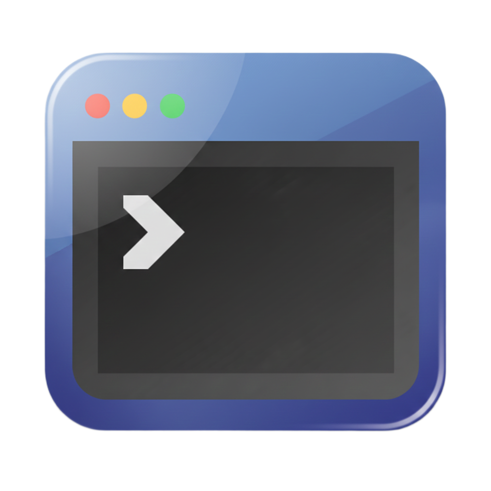

# Hterm

<p align="center">
  
</p>

<p align="center">
    
    
    
    
    
    

</p>

---

## 📖 项目简介
> **终端工具，支持建立ssh、serial、local会话**

这是一个基于 Python 开发的终端软件。它旨在提供一种简单、高效且易于扩展的方式管理使用远程机器。


## ✨ 核心特性

- 🚀 **高性能**：基于最新异步特性开发。
- 🛠️ **易配置**：图形化配置并使用 TOML 格式存储。
- 📦 **依赖少**：尽量减少外部库依赖，保持轻量。
- 🧪 **跨平台**：支持windows、macos、linux。

## 🛠️ 使用指南

### 1. 环境检查
确保你的系统已安装 **uv**。

### 2. 运行
```bash
# 同步依赖
uv sync

# 运行
uv run hterm/main.py

# 打包
uv run pack.py
```
## 👨🏻‍💻 软件架构
``` shell
+-----------------------------------------------------------------+
|                Session (Coordinator)                            |
|  * Role: Lifecycle Mgmt, Signal/Slot Binding, , Data Forwarding |
+------------------------------+----------------------------------+
               |                           |
               | (Composition)             | (Composition)
               v                           v
+-------------------------------+    +-----------------------------+
|       Terminal (View/UI)      |    |   PtyChannel (Comm Model)   |
| * QAbstractScrollArea         |    | * ABC                       |
| * Role: Capture Input, Render |    | * Role: I/O & Protocol      |
+-------------+-----------------+    +-------------+---------------+
              |                                    |
              | (Signal: input)                    | (Signal: recv)
              |                                    |
              v                                    v
        +-------------------------------------------------+
        |                                                 |
        |                 Data Flow Process               |
        |                                                 |
        +-------------------------------------------------+
          
        (1) [User Input] -------------------->  Terminal 
        
        (2) Terminal     ---[signal_input]--->  Session 
        
        (3) Session      ---[send_data]------>  PtyChannel
        
        (4) PtyChannel   ----[send]---------->  Remote Shell
        
        (5) PtyChannel   <---[recv]-----------  Remote Shell
        
        (6) PtyChannel   ----[signal_recv]--->  Session
        
        (7) Session      ----[feed]---------->  Terminal
        
        (8) Terminal     -------------------->  [Render Screen]
```